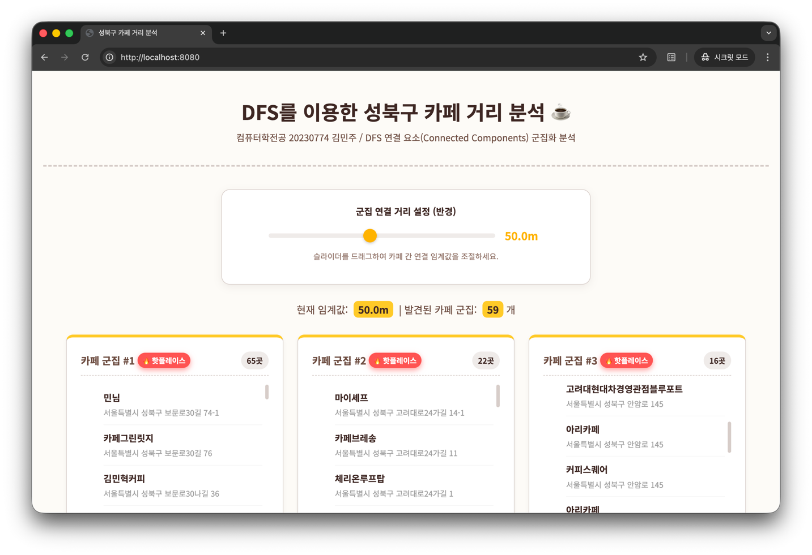

# ☕ DFS 기반 성북구 동적 카페 거리 분석

> 지리적 좌표와 그래프 이론(DFS)을 결합하여, 성북구 내의 밀집된 카페 상권을 동적으로 시각화하는 프로젝트입니다.

-----

## 1\. 💡 문제 정의

### 1.1. 배경: "행정동"과 "실제 상권"의 괴리

기존의 지도 서비스나 상권 분석 툴은 대부분 **행정구역(동, 구)** 단위로 데이터를 보여줍니다. 하지만 실제 소비자가 체감하는 '카페 거리'나 '핫플레이스'는 행정 경계를 넘나들며, 물리적으로 인접한 가게들의
집합으로 형성됩니다.

* "성북구 카페 거리"는 성북구 전체가 아니라 특정 도로를 따라 형성되어 있습니다.
* 행정 구역 기반의 통계는 이러한 **선형 혹은 군집형** 상권의 실체를 반영하지 못하는 한계가 있습니다.

### 1.2. 목표: 연결성에 기반한 동적 분석

본 프로젝트는 고정된 구역이 아닌, '거리'라는 물리적 제약을 기준으로 상권을 동적으로 정의하고자 했습니다.

* **유동적인 군집화**: 사용자가 정의한 반경(예: 50m, 100m) 내에 카페들이 서로 연결되어 있다면, 이를 하나의 거대한 '카페 군집(Cluster)'으로 간주합니다.
* **노이즈 제거**: 단순히 위치만 가까운 것이 아니라, 최소 5개 이상의 점포가 밀집된 경우에만 유의미한 상권으로 판단하여 **'핫플레이스'** 정보를 도출합니다.

-----

## 2\. 📊 사용 데이터

* **데이터 출처**: [공공데이터포털] 소상공인시장진흥공단\_상가(상권)정보
* **필터링 조건**:
    * **지역**: 서울특별시 성북구
    * **업종**: 서울특별시 성북구 내 업종 분류가 '카페'인 데이터
* **활용 속성**:
    * `상호명`: 식별자
    * `위도`, `경도`: 거리 계산의 핵심 지표
    * `도로명주소`: 사용자 정보 제공용

-----

## 3\. 🛠 구현 방법 및 알고리즘

### 3.1. 핵심 알고리즘: DFS & Connected Components

지리 데이터를 **그래프** 문제로 모델링하여 해결했습니다.

1. **그래프 모델링**:
    * **Node**: 개별 카페
    * **Edge**: 두 카페 간의 거리가 임계값 이하일 때 연결
2. **군집 탐색 (DFS, 깊이 우선 탐색)**:
    * 방문하지 않은 노드에서 탐색을 시작하여, 연결된 모든 노드를 순회합니다.
    * 탐색이 종료되면 반환된 노드들의 집합이 하나의 **연결 요소(Connected Component)**, 즉 '카페 군집'이 됩니다.
3. **사후 필터링**:
    * 탐색된 군집의 크기가 `MIN_CLUSTER_SIZE` (5개) 미만인 경우, 단순 노이즈로 간주하여 분석 결과에서 제외합니다.

```java
private void dfs(CoffeeShop current, List<CoffeeShop> allShops,
                 Set<Long> visited, List<CoffeeShop> component, double threshold
) {
    visited.add(current.getId());
    component.add(current);

    for (CoffeeShop other : allShops) {
        if (!visited.contains(other.getId())) {
            double distance = calculateDistance(
                    current.getLatitude(), current.getLongitude(),
                    other.getLatitude(), other.getLongitude()
            );
            if (distance <= threshold) {
                dfs(other, allShops, visited, component, threshold);
            }
        }
    }
}
```

### 3.2. 정밀 거리 계산: Haversine Formula

단순한 피타고라스 정리(유클리드 거리)는 평면을 가정하므로, 지구 곡률에 따른 오차가 발생합니다. 이를 보정하기 위해 하버사인 공식을 적용했습니다.

```java
private double calculateDistance(double lat1, double lon1, double lat2, double lon2) {
    final int R = 6371; // 지구 반지름 (km)
    double latDistance = Math.toRadians(lat2 - lat1);
    double lonDistance = Math.toRadians(lon2 - lon1);
    double a = Math.sin(latDistance / 2) * Math.sin(latDistance / 2)
            + Math.cos(Math.toRadians(lat1)) * Math.cos(Math.toRadians(lat2))
            * Math.sin(lonDistance / 2) * Math.sin(lonDistance / 2);
    double c = 2 * Math.atan2(Math.sqrt(a), Math.sqrt(1 - a));
    return R * c * 1000; // 미터 단위로 변환
}
```

### 3.3. 사용한 기술

* **Backend**: Java 21, Spring Boot 4.0.0, Spring Data JPA
* **Frontend**: HTML5, CSS3, Thymeleaf
* **Database**: H2
* **Etc**: OpenCSV, Lombok

-----

## 4\. 🏃‍♂️ 실행 방법

### 사전 요구 사항

Java 21+, Git이 설치되어야 합니다.

### 설치 및 실행

```bash
# 1. 레포지토리 클론 및 해당 디렉토리로 이동  
git clone https://github.com/mminjukim/DFS-cafe-cluster.git
cd DFS-cafe-cluster

# 2. 빌드 및 실행 (Mac/Linux)
./gradlew bootRun

# 2. 빌드 및 실행 (Windows)
gradlew.bat bootRun
```

### 접속

브라우저에서 `http://localhost:8080`으로 접속합니다.

-----

## 5\. 💻 실행 결과




* **거리 조절**: 슬라이더를 움직이면 실시간으로 군집이 합쳐지거나 분리되는 것을 확인할 수 있습니다.
* **시각화**: 12개 이상 밀집된 군집에는 **'🔥 핫플레이스'** 뱃지가 붙어 강조됩니다.

-----

## 6\. 🚀 개선 아이디어

### 6.1. 기술적 한계

현재 로직은 모든 카페 쌍(Pair)의 거리를 계산하여 그래프를 구축하므로, 데이터 개수가 $N$일 때 시간 복잡도는 $O(N^2)$입니다.

* **문제점**: 데이터가 10,000개가 되면 1억 번의 연산이 필요하여 실시간 응답이 불가능해집니다.
* **해결 아이디어**: MySQL의 Spatial Index (ST\_Distance\_Sphere) 기능을 활용하여 DB 레벨에서 인접 이웃을 $O(\log N)$ 수준으로 조회하도록 쿼리를 최적화할 수 있을
  것 같습니다.

### 6.2. 사용자 경험(UX) 확장

* **지도 API 연동**: 현재의 리스트 뷰는 정확한 위치 파악이 어렵습니다. Kakao Map API 등을 연동하여, 실제 지도 위에 다각형이나 마커의 클러스터 형태로
  시각화한다면 직관성이 대폭 향상될 것 같습니다.

---

## 7. 📂 디렉토리 구조

```
src
├── main
│   ├── java/com/algorithm/project
│   │   ├── domain         # CoffeeShop Entity
│   │   ├── repository     # JPA Repository
│   │   ├── infrastructure # CSV data initializer
│   │   ├── service        # ForestService (DFS Logic)
│   │   └── controller     # Web Controller
│   └── resources
│       ├── static/css     # style.css
│       └── templates      # forest-view.html (Thymeleaf View)
```